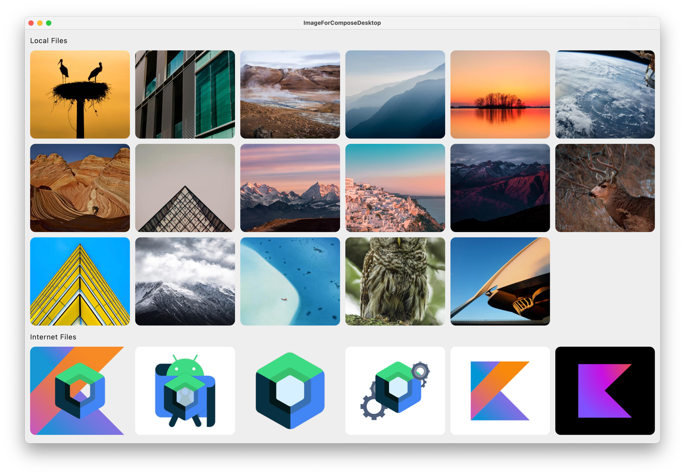

# Image For Compose Desktop

This project demonstrates how to load images for Compose Desktop.

**The most important thing is low memory usage!**



## About Libs

* [LWJGL](https://github.com/LWJGL/lwjgl3) it provides all platform native libs of [stb](https://github.com/nothings/stb), such as Windows, macOS and Linux. Before the image display we need to compress the image file, 'cause in a image file with 4000x3000 size will use 48,000,000 bytes memory, 1 pixel costs 4 bytes. So it will take too much memory when we display a `Grid`, about 1.1GB with the screenshot. So we need to compress the image before it display, but the same problem, if we compress it with Java's ImageIO, it also take too much memory, so `stb`, a C/C++ lib, is a better choice. 
* [commons-imaging](https://github.com/apache/commons-imaging) some jpeg images have `exif` infos, after compression with stb, the images' rotation maybe error. Using `BufferedImage` to rotate images can also consume a significant amount of memory, so just use this lib to write the origin exif infos to the new file.

## How to Use

This project only provides a demo to demonstrate the usage. However, you can download the code and run it on your own. But you should do something to make it be you want.

1. You should change the `appName` in `ImageCompressUtils.kt`
2. You maybe need to change the `downloadFile` in `STBImage.kt` and how to display loading and retry.
3. If you worry with the thumbs' name will be same, maybe you should change the `getThumbnailFile` create a fileName with your business, such like add `orderNo` or `galleryId` in the path. Or delete the thumbs at sometimes.

```kotlin
@Composable
fun STBImage(
    modifier: Modifier = Modifier,
    contentScale: ContentScale = ContentScale.Inside,
    data: Any?,// this project only support file (png,jpg) and url.
    targetSize: Int = 0,// 0 mean do not compress, 200 mean the min of width and height will be compressed to 200 and other one will be fit.
){
    
}
```

`STB` said that:

> image loading/decoding from file/memory: JPG, PNG, TGA, BMP, PSD, GIF, HDR, PIC

But this project only test on JPG and PNG, if you need to display other type, you need do something by yourself.

And this project only test on Windows 11 x86 and macOS Sonoma arm64.


## build.gradle.kts is important

It generated by [https://www.lwjgl.org/customize](https://www.lwjgl.org/customize)
